YOUTUBE LINK: link

# Language and Cognition : the neural relationship

## Data Processing Method

### Brain Data
The dataset consists of 77 subjects, and for each subject, 
* anatomical image - a brain image that serves as a structural reference for processing functional images
* functional image - a series of brain image captured over multiple runs of experiment. It has lower resolution compare to anatomical image.

In data processing, I used FEAT, FSL's preprocessing tool. FSL is a comprehensive library of analysis tools for functional, structural, and diffusion MRI brain imaging data, developed by the Analysis Group at FMRIB in Oxford.

Detailed description of data processing done so far.

1. Brain Extraction

Since the original image includes skull and non-brain area, we need to remove those area to focus on brain tissue. FSL has brain extraction tool for preprocessing the data.

One variable I experimented with was Fractional intensity threshold, which decides the brain outline estimate and how much to remove. The default value is 0.5, and smaller values give larger brain outline estimate. Among 0.7, 0.5, 0.3, 0.2, and 0.1, the value 0.2 resulted the best skullstripped image with removing skull and not missing brain tissue.

* original data 
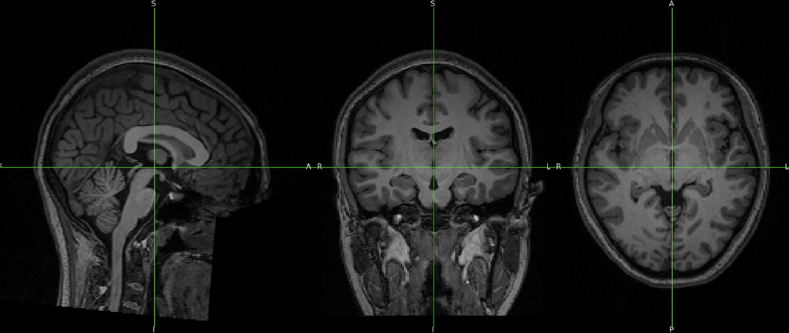
* data after bet (Fractional Intensity Threshold = 0.2)

2. Other preprocessing settings

Followings are the setting values for preprocessing

* Motion Correction : MCFLIRT
* Slice - Timing Correction : None (default)
* Smoothing - Spatial smoothing FWMH (mm) : default 5.0
* Registration and Normalization : Degree of Freedom 12

Summary registration, FMRI to standard space  
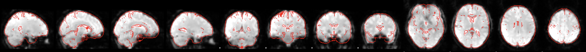

source: https://andysbrainbook.readthedocs.io/en/latest/fMRI_Short_Course/fMRI_04_Preprocessing.html

### Behavioral / Participant Data

Since the data is already cleaned and preprocessed by the data uploader and the null value was not found in the dataset, the original data was used for the analysis.

**More info about data can be found in data_inspection.ipynb**

## Data Modeling Method

1. The General Linear Model - for brain data

With a GLM, we can use one ore more regressors, or independent variables, to fit a model to some outcome measure, or dependent variable. To do this we compute numbers called beta weights, which are the relative weights assigned to each regressor to best fit the data. Any discrepancies between the model and the data are called residuals.

In FEAT analysis, the number of EV(Explanatory Variables) would be the number of regressors, and other settings, such as Basic shape, Convolution, Phase, temporal derivative, temporal filtering, would influence on beta weights and residuals for the general linear modeling.

2. Correlation

Correlation analysis is used to measure the strength and direction of the relationship between different variables. In this study, correlation analysis was performed to assess the relationships between cognitive scores, language proficiency measures, and reaction times. Pearson correlation coefficients were computed to quantify these relationships, providing insights into potential dependencies among variables.

For instance, correlations were examined between Raven's Progressive Matrices scores and English proficiency measures (writing, listening, speaking, and reading), as well as between CET 4 scores and the same language skills. Additionally, age of acquisition (AoA) was correlated with various language and cognitive measures to investigate its impact on learning outcomes. 

This method helps in selecting relevant features for further modeling and understanding the underlying structure of the data before applying more complex analytical techniques.

## Preliminary Results & Visualization of Data

### Brain Data
Stats
* Number of original EVs:2
* EV1: SWITCH, EV2: NOTSWITCH
* Basic shape: Custom (3 column format)
* Convolution: Double_Gamma HRF
* Phase: 0
* NO temporal derivative, temporal filtering

Contrasts & F-tests
* Contrast: 1, F-tests: 0

Post-stats
* Thresholding: Cluster
* Z threshold: 3.1
* P threshold: 0.05

**RESULT**

* Followings are the results from the 1st-level analysis of brain data with sub-001 of Cognitive Control

Time series graph of BOLD. Left is Switch and Right is Not Switch  
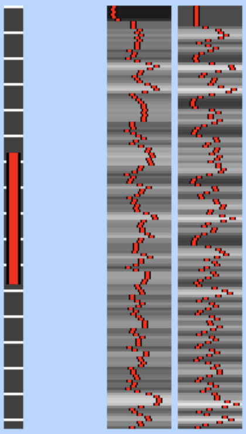

* The result from the general linear model 
The red line(data) is the original BOLD graph, and green(cope partial model fit) and blue(full model fit) lines are the results of the GLM. 
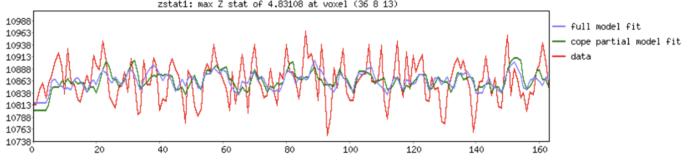

* Red areas in the following image are the voxels which are statistically significant for each contrast  
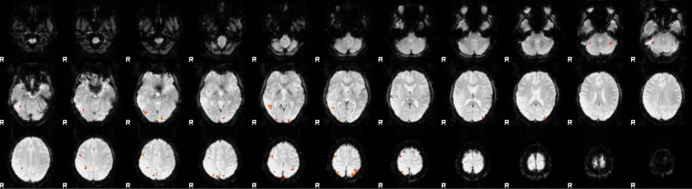

### Behavior / Participants Data

For midterm report, I focused on analyzing the correlation between various participant data variables to identify the most relevant features for modeling with brain data. Below, I summarize the key correlation patterns observed in the dataset.

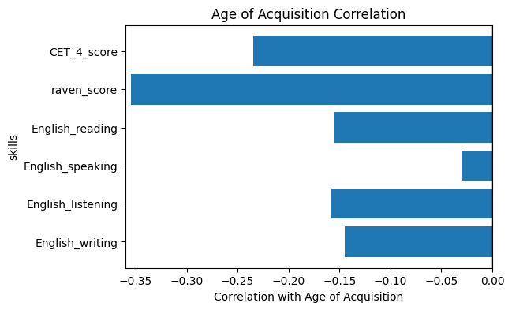

* Age of Acquisition (AoA) & English Skills Correlations  
AoA showed negative correlations with all English skills, with the strongest effects in listening (-0.1578), reading (-0.1550), and writing (-0.1445). This suggests that earlier exposure to English is associated with better language proficiency. Additionally, AoA negatively correlated with Raven Score (-0.3546) and CET 4 Score (-0.2343), implying that early language acquisition may be linked to higher cognitive and language proficiency.

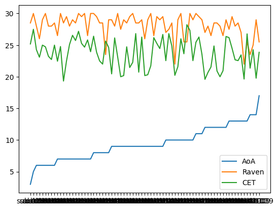

Raven Score & CET 4 Score Correlation: 'raven_score & CET_4_score': 0.233705913960944  

* Chinese Langauge RT Correlations  
Both RT_L1S and RT_L1NS exhibited negative correlations with Chinese language skills. The strongest effects were seen in speaking (-0.1922 for RT_L1S, -0.1355 for RT_L1NS) and writing (-0.1718 for RT_L1S, -0.1443 for RT_L1NS), indicating that faster reaction times may be associated with better proficiency in Chinese. Reading was the least correlated.

* English Langauge RT Correlations  
RT_L2S and RT_L2NS negatively correlated with English skills, particularly in listening (-0.2629 for RT_L2S, -0.2268 for RT_L2NS) and speaking (-0.2492 for RT_L2S, -0.2393 for RT_L2NS). This suggests that faster reaction times are linked to better English proficiency, particularly in oral and auditory skills. Reading was also the one which is least correlated.

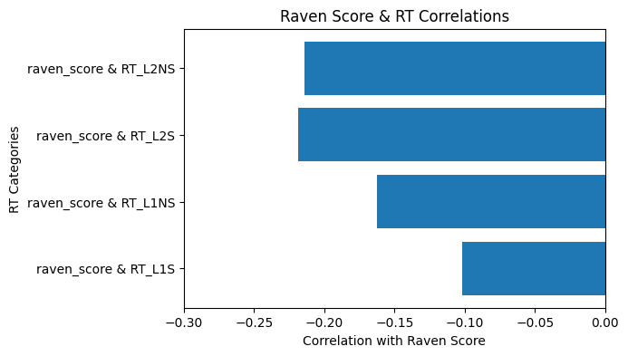
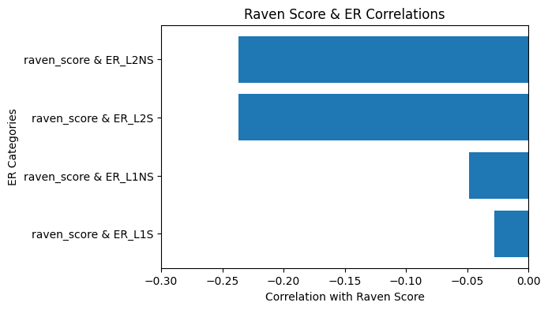

**Raven Score** : standardized intelligence test that assesses nonverbal reasoning and problem-solving skills through visual patterns.  
* Raven Score is modestly correlated with English proficiency, particularly in reading and writing.
* Higher cognitive ability (Raven Score) and English proficiency (CET 4 Score) are linked to lower error rates in second-language processing.

raven_RT_correlations:  
'raven_score & RT_L1S': -0.10192948032642571,  
'raven_score & RT_L1NS': -0.1627018508981041,  
'raven_score & RT_L2S': -0.21882178716367187,  
'raven_score & RT_L2NS': -0.21413055014757756 

raven_ER_correlations:  
'raven_score & ER_L1S': -0.027472844891422755,  
'raven_score & ER_L1NS': -0.04825089641629403,  
'raven_score & ER_L2S': -0.2367312466937776,  
'raven_score & ER_L2NS': -0.23652282254830348 

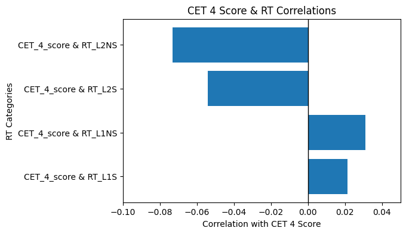
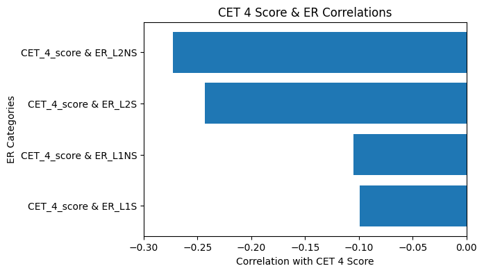

**CET 4 score** : national English proficiency test for non-English majors in China  
* CET 4 Score exhibits stronger correlations with all English skills compare to Raven score, 
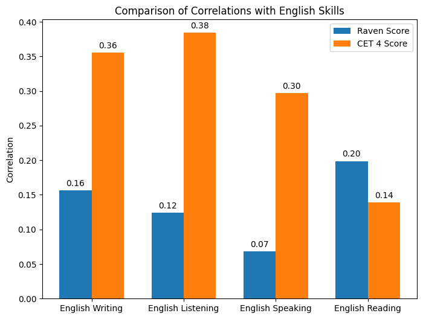

cet_4_RT_correlations:  
'CET_4_score & RT_L1S': 0.02146256794702048,  
'CET_4_score & RT_L1NS': 0.031085003279216688,  
'CET_4_score & RT_L2S': -0.053926295229138145,  
'CET_4_score & RT_L2NS': -0.07319903667206928 

cet_4_ER_correlations:  
'CET_4_score & ER_L1S': -0.09920154371578252,  
'CET_4_score & ER_L1NS': -0.10498877572452256,  
'CET_4_score & ER_L2S': -0.24290970386183677,  
'CET_4_score & ER_L2NS': -0.272698476085984 

## Next Steps

1. Preprocess the remaining dataset with the same setting

The preprocessing is only done with sub-001. We need to apply preprocessing with the same setting to the reamining 76 subjects. I would write bash script to run the preprocessing and 1st-level analysis. The result would be the basis of the group analysis

2. Feature Extraction

* Extract relevant features from structural and task-related functional imaging data
* Process behavioral data (e.g. reaction times, error rate, task_order, task_rule )

3. Model Training
* Apply linear regression using language proficiency scores, Age of English Acquisition, and extracted fMRI features
* Optimize the model with evaluation

4. Result Interpretation
* Visualiza key findings using statistical plots and brain activation maps

**Reference**  
fMRI short course with fsl https://andysbrainbook.readthedocs.io/en/latest/fMRI_Short_Course/fMRI_Intro.html

Machine learning in fMRI https://www.ehu.eus/ccwintco/uploads/f/f5/Feature_extraction_uji_2010.pdf
