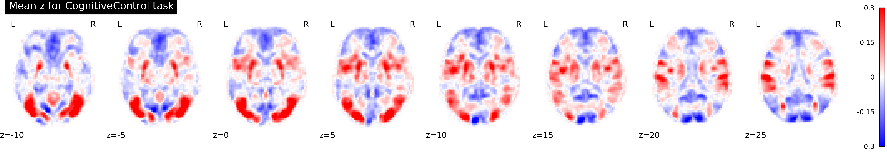
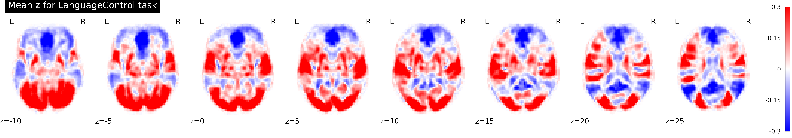
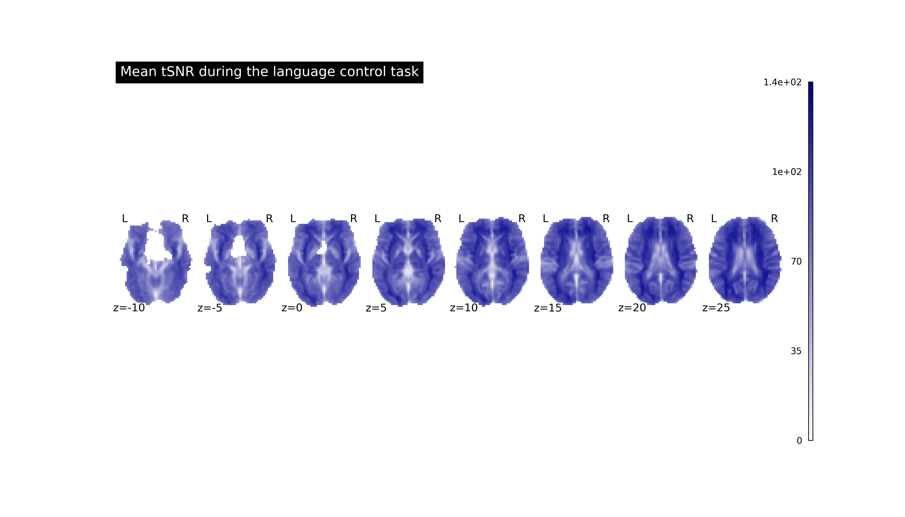
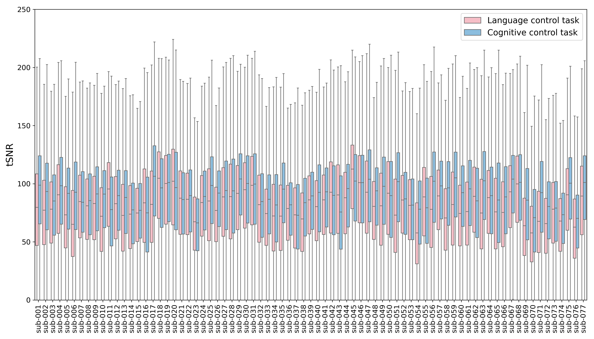
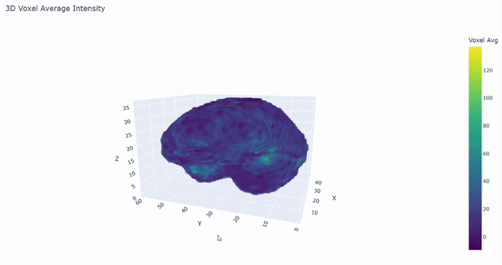
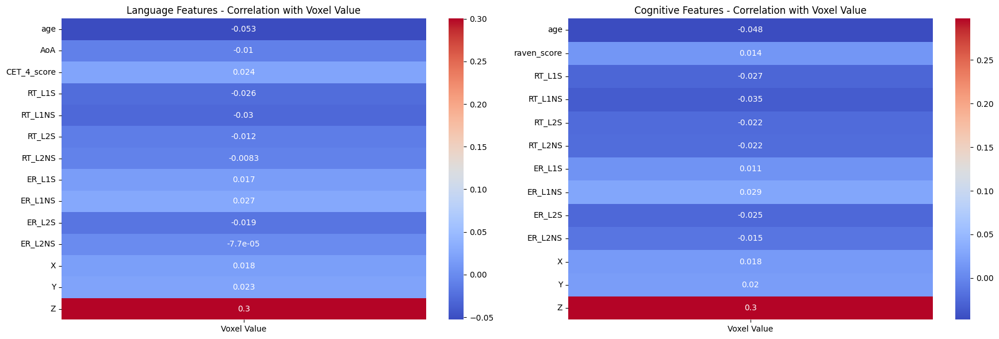

YOUTUBE LINK: 

# Language and Cognition : the neural relationship

## How to Build and Run the code

**WARNING : the size of the dataset is around 15GB**

1.  Initial setup for reproduction

```
git clone https://github.com/ojnim/cs506-final-project.git
cd cs506-final-project
make install
datalad clone https://github.com/OpenNeuroDatasets/ds005455.git data
cd data
datalad get *
mkdir -p ../data/derivatives/figure
```
2. Reproduce Figures

```
cd code
python3 singletrial_plot
python3 tsnr_plot
python3 tsnr_plot_box
```
3.  Reproduce Result
```
cd code
python3 tsnrdata_to_csv
python3 singletrial_activation
#Run All modeling.ipynb
```

**4. Test Code and a GitHub workflow that runs the test code**

The workflow can be found in modeling.ipynb 

Since the size of original dataset is around 15 GB, the initial stage of preprocessed were completed locally, and 10 subjects out of 77 were sampled for test. The sample data is in data_for_test directory.

Following is the sample run of the analysis.
```
git clone https://github.com/ojnim/cs506-final-project.git
cd cs506-final-project
make install
make preprocess
make train
```

## Data Preprocessing

This project is based on https://github.com/OpenNeuroDatasets/ds005455.git and some codes and scripts are modified from https://github.com/GttNeuro/Guo-Lab_datapaper.

### Brain Data
The dataset consists of 77 subjects, and for each subject, 
* anatomical image - a brain image that serves as a structural reference for processing functional images
* functional image - a series of brain image captured over multiple runs of experiment. It has lower resolution compare to anatomical image.

In data processing, FSL's preprocessing tool FEAT was used for fMRI data preprocessing and computing the temporal signal-to-noise ratio . FSL is a comprehensive library of analysis tools for functional, structural, and diffusion MRI brain imaging data, developed by the Analysis Group at FMRIB in Oxford.

After preprocessing works (e.g. brain extraction, motion correction, smoothing, and normalization) on Brain data was done through the bash script with preprocessing templates in templates directory, to verify the meaningful voxels to analyze, Temporal Signal-to-Noise Ratio was calculated with nilearn library and saved to csv file with Voxel Value, X, Y, Z, Task, and Subject columns.

From tsnr_voxel_data.csv, the rows whose Voxel Value is NaN are dropped.

Reference: https://github.com/GttNeuro/Guo-Lab_datapaper , https://github.com/DVS-Lab/srndna-datapaper?tab=readme-ov-file 

### Participants & Behavioral Data

**Original Columns** : 'participant_id', 'age', 'sex', 'task_order', 'task_rule', 'AoA', "RT_L1S","RT_L1NS","RT_L2S","RT_L2NS", "ER_L1S","ER_L1NS","ER_L2S","ER_L2NS","raven_score", "CET_4_score", "Chinese_writing", "Chinese_listening", "Chinese_speaking", "Chinese_reading", "English_writing", "English_listening", "English_speaking", "English_reading"
<br>

For the analysis of both Tasks, Reaction Time and Error Rate columns are included since they are collected during the experiment. The columns of self-reported language skills were excluded during the feature selection process since the other column already relflects the participants' language ability and the value itself is subjective. However, they were utilized during the correlation analysis in feature selection process to identify which columns shows meaningful relationship with language abilities.

1. Language Task Features<br>
['age', 'AoA', 'CET_4_score','RT_L1S', 'RT_L1NS', 'RT_L2S', 'RT_L2NS','ER_L1S', 'ER_L1NS', 'ER_L2S', 'ER_L2NS']

CET 4 : national English proficiency test for non-English majors in China

2. Cognitive Task Features<br>
['age', 'AoA', 'raven_score', 'RT_L1S', 'RT_L1NS', 'RT_L2S', 'RT_L2NS','ER_L1S', 'ER_L1NS', 'ER_L2S', 'ER_L2NS']

raven score : standardized intelligence test that assesses nonverbal reasoning and problem-solving skills through visual patterns


**More info about Participants & Behavioral Data can be found in data_inspection.ipynb, behavioral_data_analysis.ipynb**

## Visualizations

* Mean z for each task : The mean of single-trial fMRI activation estimates for both tasks. They are averaged across 77 subjects.




* Mean tSNR for each task : The mean temporal Signal-to-Noise Ratio (tSNR) map for both tasks (left: Cognitive, right: Language)
<p>


</p>

* Distribution of tSNR per participant and task

<br>
What we can commonly observe accross different subjects is tSNR values of CogControl taks are higher than the values of LangControl <br>

* 3D visualization of Temporal Signal-to-Noise Ratio in different brain region



## Modeling

1. tSNR value correlation

Model : Correlation

To explore the relationship between brain signal quality and individual differences, a correlation analysis with the tSNR (temporal Signal-to-Noise Ratio) values was conducted. The objective was to identify which independent variables are meaningfully associated with tSNR, a voxel-wise measure derived from brain imaging data.

2. Brain Region Analysis

Model : Linear Regression

The reason linear regression was selected is to analyze relationships between continuous variables. For the Analysis, Dependent variable would be the tSNR value from each voxel, which is a continuous value from brain image.

The linear regression model was trained with 80% of the data for each task and tested with the remaining 20% of the dataset. Finally for each voxel (x,y,z), R^2 score, p value for Age of Acquisition, p value for CET 4 score(Language Control), p value for raven score(Cognitive Control), and number of observation were saved in a dataFrame for each task. 

In neuroscience field, a good R-squared value generally falls between 0.7 and 0.9. Therefore, when filtering the voxel groups, 0.8 was used as a threshold value, and to mitigate the overfitting problem, the rows with R^2 over 0.95 were removed. P value for each participant features were set as 0.05.

## Results

1. tSNR value correlation

For both LanguageControl task and CognitiveControl task, correlation value between tSNR value and features turned out to be similar. Z-coordinate (Z) has the strongest positive correlation (0.3) in both tasks. This likely means higher voxel values are associated with more superior (top) brain regions. Most other correlations are small in magnitude (between -0.05 and +0.03), suggesting weak direct linear associations.



The Z-coordinate dominates correlation, suggesting location in the brain matters more than behavior measures in voxel value variation. Language-related metrics (CET-4, AoA) show weak but present correlations in the language task. Raven score and RT/ER features in the cognitive task also show small effects. All behavioral measures have weak correlations, implying more complex (nonlinear or localized) relationships, or that voxel values are affected by other unmodeled factors.

2. Brain Region Analysis

As a result of modeling, 3089 voxel groups for Language Control and 4459 voxel groups for Cognitive Control remained after filtered with p value for Age of Acquisition. 

A Jaccard index of 0.214 between two suggests a moderate amount of overlap between Language Control task and Cognitive Control task. It implies that AoA affects both language and cognitive control, but possibly in distinct neural regions.


* git clone this repo and access voxel_overlap_plot.html to interact to this visualization

In this 3D visualization of overlapped voxels, it was observed that overlapped voxels are significantly concentrated near corpus callosum, whose main function is  facilitating communication and transferring information between the left and right hemispheres of the brain.

## Future Steps

1. Voxel Value Prediction

While the data for BOLD activation was prepared with singletrial_activation file in code directory, the analysis on activation was not completed due to the lack of time and computing resources. Therefore, in the future, the analysis on this data can be completed with using tSNR data as a quality threshold.

2. Brain Region Analysis

Functional or anatomical brain regions can be compared to the X,Y,Z coordinates of overlapped voxels. The possible questions can be "Are overlaps located in a specific brain region (e.g., frontal lobe)?"
